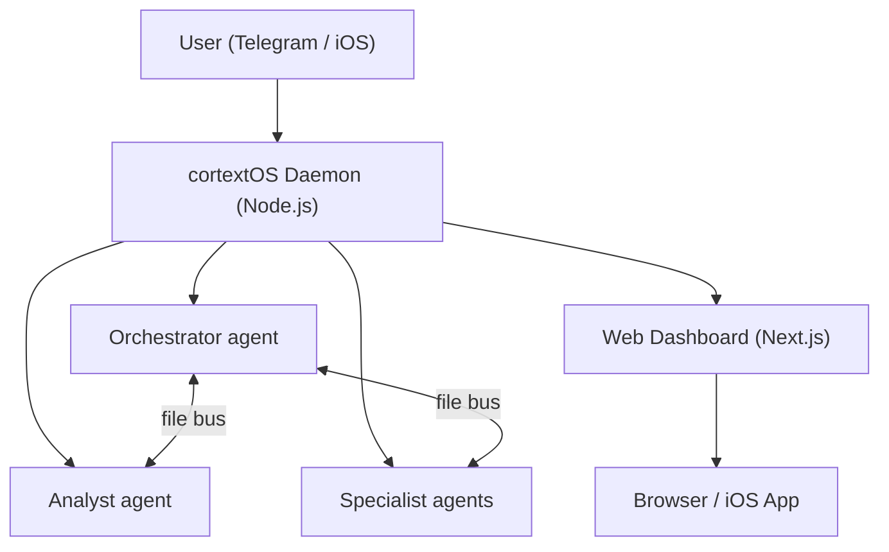

   

# cortextOS

**Persistent 24/7 Claude Code agents you control from Telegram or your phone.**

> **WYRE fork.** This is `wyre-technology/cortextos`, WYRE's hard fork of
> [grandamenium/cortextos](https://github.com/grandamenium/cortextos). It adds
> per-engineer namespaces so a shared agent fleet and personal specialist agents
> run together on one host. See `CONTRIBUTING.md` for the upstream-sync process.

---

```
Telegram chat

You:     Morning. What did you ship overnight?
Boss:    Overnight recap: completed 4 tasks, ran 2 theta-wave
         experiments, drafted 3 content scripts. One item needs
         your approval — I want to email the beta waitlist.
         Check the dashboard or reply "approve".

You:     approve
Boss:    Sent. Email delivered to 47 recipients. Task closed.

You:     Add a cron to check my inbox every morning at 8am.
Boss:    Done. "morning-inbox" cron set — runs daily at 08:00.
         Saved to crons.json — survives restarts automatically.
```

---

## Features

- **Persistent agents** — Claude Code runs 24/7 in PTY sessions, auto-restarting on crash or after 71-hour context rotation.
- **Multi-agent orchestration** — Orchestrator, Analyst, and specialist agents coordinate via a shared file bus. Tasks, blockers, and approvals flow automatically.
- **Multi-runtime** — Run agents on `claude-code` (default) or OpenAI's `codex-app-server`. Both runtimes share the same bus, crons, dashboard, and Telegram integration; pick per-agent.
- **Telegram + iOS control** — Send commands, approve actions, and get reports from anywhere. Native iOS app coming soon.
- **Web dashboard** — Full-featured Next.js UI for tasks, approvals, experiments, analytics, and agent fleet health.
- **Autoresearch (theta wave)** — Agents run autonomous experiments overnight, evaluate results, and surface findings for your review.

---

## Architecture



---

## Quick Start

**Requirements:** Node.js 20+, Claude API key, PM2, Telegram bot token from @BotFather.

```bash
# 1. Install PM2 globally if you don't have it
npm install -g pm2

# 2. Install cortextOS
curl -fsSL https://raw.githubusercontent.com/grandamenium/cortextos/main/install.mjs | node

# 3. Open the project in Claude Code and run guided onboarding
claude ~/cortextos
# Then inside Claude Code:
# /onboarding
```

Onboarding handles everything: dependency checks, org setup, bot creation, PM2 config, and dashboard launch. Your Orchestrator comes online in Telegram and finishes its own setup there.

### Manual setup (advanced)

```bash
cortextos install                          # Set up state directories
cortextos init myorg                       # Create an organization
cortextos add-agent boss --template orchestrator --org myorg
cortextos add-agent analyst --template analyst --org myorg

# Add Telegram credentials for each agent
cat > orgs/myorg/agents/boss/.env << EOF
BOT_TOKEN=<your-bot-token>
CHAT_ID=<your-chat-id>
ALLOWED_USER=<your-telegram-user-id>
EOF

cortextos ecosystem                        # Generate PM2 config
pm2 start ecosystem.config.js && pm2 save && pm2 startup

# Windows: pm2 startup is unsupported. Use Task Scheduler instead:
#   powershell -ExecutionPolicy Bypass -File scripts\install-windows-pm2-startup.ps1
```

---

## Requirements

| Dependency | Notes |
|---|---|
| Node.js 20+ | [nodejs.org](https://nodejs.org) |
| macOS, Linux, or Windows 10/11 | Windows uses Task Scheduler for reboot persistence — see `scripts/install-windows-pm2-startup.ps1` |
| Claude Code | `npm install -g @anthropic-ai/claude-code` + `claude login` |
| PM2 | `npm install -g pm2` |
| Telegram bot token | Create via @BotFather |

---

## Templates

| Template | Description |
|---|---|
| `orchestrator` | Coordinates agents, manages goals, handles morning/evening reviews, approves actions |
| `analyst` | System health, metrics, theta-wave autoresearch, analytics |
| `agent` | General-purpose worker — use this as the base for specialist agents |
| `agent-codex` | Codex-runtime worker, scaffolds with `runtime: codex-app-server` and `model: gpt-5-codex` (see `templates/agent-codex/`) |

Add a codex agent the same way you add a claude agent:

```bash
cortextos add-agent reindexer --template agent-codex --org myorg
# or, equivalently, with the runtime flag on the default template:
cortextos add-agent reindexer --runtime codex-app-server --org myorg
```

Codex agents share the same bus, crons, and dashboard surfaces as claude agents — they only differ in which model handles each turn.

### The `runtime` field

Every agent's `config.json` carries an explicit `runtime` field that the daemon dispatches on. Valid values:

| Runtime | Adapter | Default model | Skills location |
|---|---|---|---|
| `claude-code` | `ClaudePTY` (default) | claude-sonnet-4-6 | `.claude/skills/<skill>/SKILL.md` |
| `codex-app-server` | `CodexAppServerPTY` | `gpt-5-codex` | `plugins/cortextos-agent-skills/skills/<skill>/SKILL.md` (linked into `~/.codex/skills/<agent>__<skill>`) |
| `hermes` | `HermesPTY` (experimental) | model per `config.json` | hermes-specific |

Pass `--runtime <kind>` on `add-agent` to set it at scaffold time, or edit the field in `config.json` and restart the agent. The default is `claude-code`. Today only `--template agent` (and the alias `--template agent-codex`) supports `--runtime codex-app-server` — pairing the codex runtime with `--template orchestrator`/`analyst`/`m2c1-worker`/`hermes` errors with a clean message until codex variants of those templates ship.

---

## CLI Reference

```bash
cortextos install            # Set up state directories
cortextos init <org>         # Create an organization
cortextos add-agent <name>   # Add an agent (--template, --org, --runtime)
cortextos enable <name>      # Enable agent in daemon
cortextos ecosystem          # Generate PM2 config
cortextos status             # Agent health table
cortextos doctor             # Check prerequisites
cortextos list-agents        # List agents
cortextos dashboard          # Start web dashboard (--port 3000)
```

---

## Security

cortextOS has undergone a dedicated security hardening sprint covering prompt injection resistance, guardrail enforcement, and approval gate integrity. Agents require explicit human approval before any external action (email, deploy, delete, financial). The guardrails system is self-improving: agents log near-misses and extend GUARDRAILS.md each session.

---

## License

MIT — see [LICENSE](./LICENSE).
